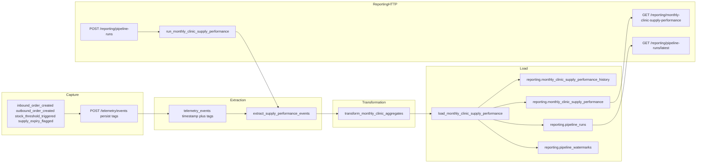

# HealthCore Monthly Clinic Supply Performance Pipeline

**Status:** Part 1 design plus Part 2 implementation contract. Prefect flows and `services/reporting/` are implemented in Part 2. The Part 3 dashboard is out of scope.

**Company context:** HealthCore Digital. Audience for the output is Dr. Okonkwo (CEO) and Claire Whitfield (Chief Compliance Officer).

**Evidence date:** Part 1 inspected the `feat/telemetry-event-capture` worktree. Part 2 implements against the integrated baseline that includes telemetry persistence (`timestamp` + `tags`) and the technical report. Capture-envelope fields remain in `properties`; persisted KPI fields are read from `tags`.

---

## 1. Current State

### 1.1 What is captured today

The approved capture contract in `docs/telemetry/event-schemas.json` and `uis/talent-pipeline-tracker/lib/telemetry/schema.ts` defines **16** event types. The frontend instrumenter in `uis/talent-pipeline-tracker` emits them through `src/services/telemetry.ts`.

The four event types this pipeline will consume in v1 already exist in that catalogue:

| `event_type` | Emitter | Live trigger |
| --- | --- | --- |
| `inbound_order_created` | `trackInboundOrderCreated` | `POST /inventory/orders/inbound` HTTP 201 from `SupplyDeliveryForm` |
| `outbound_order_created` | `trackOutboundOrderCreated` | `POST /inventory/orders/outbound` HTTP 201 |
| `stock_threshold_triggered` | `trackStockThresholdTriggered` | remaining clinic stock below `MedicalSupply.minimum_stock` after an outbound write |
| `supply_expiry_flagged` | `trackSupplyExpiryFlagged` | catalog `expiry_date` within a 30-day UTC window, throttled once per `product_id` per UTC day |

The remaining 12 designed events (`direct_stock_edit_rejected`, auth, API latency, page load, frontend errors, and related operational events) are out of v1 scope for this pipeline. They are not deleted. They continue to serve engineering and control-use cases.

Envelope fields on every event, from `app/schemas/telemetry.py` and `event-schemas.json`:

- `eventId` (UUID)
- `timestamp` (ISO-8601)
- `sessionId` (UUID)
- `userId` (staff TinyDB id, or `null`)
- `event_type`
- `schemaVersion` (`1.0.0`)
- `requestId` (UUID)
- `properties` (closed allowlist per `event_type`)

`userId` is a workforce identifier from TinyDB auth. It is not a patient identifier. This pipeline must not copy `userId` into reporting tables, endpoint payloads, execution logs, diagrams, or fixtures.

### 1.2 Where events are stored

`telemetry_events` is persisted by `POST /telemetry/events` through `app.services.telemetry_storage`. The physical stored contract is:

| Column | Meaning |
| --- | --- |
| `event_id` | envelope `eventId` |
| `timestamp` | envelope `timestamp` (event time; this is the extract clock) |
| `session_id` | envelope `sessionId` |
| `user_id` | envelope `userId` (engineering only; pipeline extract projects it out) |
| `event_type` | envelope `event_type` |
| `schema_version` | envelope `schemaVersion` |
| `request_id` | envelope `requestId` |
| `tags` | allowlisted envelope `properties` |

There is no `ingested_at` or `properties` column. Supply cost is stored at `tags.total_cost`. Ingest is write-once (`ON CONFLICT DO NOTHING` on `event_id`) and returns `{ "received", "stored", "rejected" }`.

The pipeline never writes aggregates, run logs, or watermarks back into `telemetry_events`. If the table is missing, a Part 2 run fails with an explicit source-unavailable error rather than publishing zeros. An empty but reachable table is legitimate zero activity for that month.

Inventory domain tables (`medical_supply`, `supply_delivery`, `supply_consumption`) store operational supply records in Supabase via SQLModel. They are not the pipeline destination. v1 does not join them to compute KPIs, and it does not join any patient-level table.

### 1.3 Technical telemetry report (present; out of scope for this pipeline)

The engineering report is served by `services/telemetry/analysis.py` and `GET /telemetry/report`. It remains a separate path from `services/reporting/` and `reporting.monthly_clinic_supply_performance`. Part 2 does not modify it.

| Component | Baseline |
| --- | --- |
| `services/telemetry/analysis.py` | Present. Reads `timestamp`, `event_type`, and `tags` for operational volume, error, and latency metrics. |
| `GET /telemetry/report` | Present, with a 60-second cache. Not a business KPI endpoint. |
| `services/reporting/` | Implemented in Part 2 for the Monthly Clinic Supply Performance Report. |

### 1.4 Business gap

Even if the engineering report existed exactly as the assignment describes (volume, error rate, latency), it would not answer the leadership question.

Dr. Okonkwo and Claire need a monthly, per-clinic, per-country view of:

1. Supply Cost per Clinic
2. Supply Consumption Volume
3. Critical Stockout Frequency
4. Expiry Risk Count

What exists today (persisted `telemetry_events` plus `GET /telemetry/report`) can tell engineers event volume, error rate, and latency. That does not produce monthly clinic supply cost, consumption volume, critical stockout frequency, or expiry risk. That is the gap this pipeline exists to close.

### 1.5 `data/` layout as it exists

The assignment names `raw/`, `processed/`, `pipelines/`, and `evals/`. This repository currently has:

- `data/raw/`
- `data/process/` (not `processed/`)
- `data/pipelines/`
- `data/eval/` (not `evals/`)

Orchestration and reusable transform code for this pipeline will live under `data/pipelines/`. HTTP trigger and query orchestration will live under a new `services/reporting/` module. No ETL logic belongs in `services/`.

---

## 2. Concrete Pipeline Purpose

This pipeline produces the Monthly Clinic Supply Performance Report on a monthly cadence for Dr. Okonkwo and Claire by computing Supply Cost per Clinic, Supply Consumption Volume, Critical Stockout Frequency, and Expiry Risk Count from `inbound_order_created`, `outbound_order_created`, `stock_threshold_triggered`, and `supply_expiry_flagged`.

---

## 3. Extraction Design

### 3.1 Source

**Primary source (required):** `telemetry_events` (read-only).

The pipeline never writes aggregates, run logs, or watermarks back into `telemetry_events`.

**Other domain tables:** none required for v1 KPI math. `clinic_id`, `country`, `total_cost`, and the four event types are on the events themselves after the `total_cost` capture extension. Inventory tables may be used later as a reconciliation check. They are not joined for v1 board numbers, and patient-level tables are never joined.

### 3.2 Event format

Capture clients still send the envelope `properties` object. Persistence projects allowlisted keys into `tags`. Extraction reads the physical stored shape:

| Column | Source |
| --- | --- |
| `event_id` | envelope `eventId` |
| `timestamp` | envelope `timestamp` (used as event time / `occurred_at` equivalent) |
| `event_type` | envelope `event_type` |
| `tags` | allowlisted envelope `properties` |

There is no `ingested_at` column. Do not add one. v1 always recomputes the full UTC month from `timestamp`.

`userId` may be stored as `user_id` for engineering use. Extraction for this pipeline **projects it out**. Reporting extracts must select only:

- `event_id`
- `timestamp`
- `event_type`
- `tags.clinic_id`
- `tags.country`
- `tags.total_cost` (inbound only)
- business keys inside tags (`inbound_order_id`, `outbound_order_id`, `triggering_outbound_order_id`, `product_id`)

### 3.3 How and when source data is updated

Today, successful backoffice writes enqueue a new envelope. The client assigns a new `eventId` per `track()` call and retries the **same** batch (same `eventId` values) on transient HTTP failure.

Once `telemetry_events` exists, ingest is append-only:

- A new real-world action creates a new `event_id`.
- A retried transmission of the same envelope hits `UNIQUE (event_id)` and is not inserted again.
- Capture does not update existing telemetry rows. A late event is a **new insert** whose `timestamp` may fall in an already published month.

v1 does not overwrite telemetry rows. The pipeline recomputes the full month from current `timestamp` values.

### 3.4 Monthly time window

Grain: one output row per `clinic_id` per calendar month.

- `month_start` = first day of the UTC calendar month of `timestamp`.
- Inclusive start: `timestamp >= month_start 00:00:00 UTC`.
- Exclusive end: `timestamp < month_start + 1 month`.

Scheduled run (first working day of month M): process month M-1 in UTC. Manual `POST /reporting/pipeline-runs` recomputes a requested month, including late events whose `timestamp` falls in that month.

Manual run: optional `month_start` query/body argument. If omitted, use the previous completed UTC month.

Backfill: caller supplies an inclusive `month_start` range. Each month is extracted and upserted independently.

### 3.5 Detecting delayed or updated source records

Concrete mechanism (control table plus ingest timestamp):

Table `reporting.pipeline_watermarks` (implemented in Part 2):

| Column | Type | Meaning |
| --- | --- | --- |
| `month_start` | `date` PRIMARY KEY | UTC month the watermark describes |
| `last_ingested_at` | `timestamptz` | highest source `timestamp` included in the last successful load of that month (control-table name retained; source has no `ingested_at`) |
| `updated_at` | `timestamptz` | when this watermark row was written |

Extraction for month M:

1. Read events with `event_type` in the v1 set and `timestamp` in month M.
2. v1 **always recomputes the entire month** from the current extracted set after `event_id` deduplication. The watermark does not slice the month into incremental counts.
3. Duplicate inbound/outbound business keys keep the earliest `timestamp`.

This is a last-ingested watermark plus a unique-key upsert on the destination, not an incremental add of new counts.

### 3.6 Deduplication identity available in the current data model

| Layer | Identity | Present today? |
| --- | --- | --- |
| Capture envelope | `eventId` UUID | Yes. Generated in `track()` as `window.crypto.randomUUID()`. |
| Inbound business key | `(event_type, inbound_order_id)` | Yes on `inbound_order_created`. `inbound_order_id` is `SupplyDelivery.id`. |
| Outbound business key | `(event_type, outbound_order_id)` | Yes on `outbound_order_created`. `outbound_order_id` is `SupplyConsumption.id`. |
| Stockout correlator | `triggering_outbound_order_id` plus `product_id` plus `clinic_id` | Yes on `stock_threshold_triggered`. Frontend also throttles once per `product_id:clinic_id` until stock recovers. |
| Expiry correlator | `product_id` plus UTC calendar day | Frontend throttle only (`productId:YYYY-MM-DD` in `sessionStorage`). No durable warehouse key yet. |
| Destination business key | `(clinic_id, month_start)` | Designed unique constraint on `reporting.monthly_clinic_supply_performance`. |

Pipeline extraction deduplicates by `event_id` first. A second pass drops duplicate inbound/outbound business keys, keeping the earliest `timestamp` so a double-emitted order cannot inflate cost or consumption.

---

## 4. Transformation Design

Transformation lives in `data/pipelines/`, planned function `transform_monthly_clinic_aggregates`. It converts the four v1 event types into the four KPI columns. It never writes to `telemetry_events`.

### 4.1 Event type to KPI field

| KPI | Output column | Rule |
| --- | --- | --- |
| Supply Cost per Clinic | `total_supply_cost` | `sum(tags.total_cost)` for valid `inbound_order_created` in the month |
| Supply Consumption Volume | `supply_consumption_count` | `count(*)` of valid `outbound_order_created` in the month |
| Critical Stockout Frequency | `critical_stockout_count` | `count(*)` of valid `stock_threshold_triggered` in the month |
| Expiry Risk Count | `expiry_risk_count` | `count(*)` of valid `supply_expiry_flagged` in the month |

HealthCore names used as-is: `clinic_id` (live integer `1`–`12`, stored on the destination as `text`), `country` (`US` or `UK`), `SupplyDelivery` / inbound order, `SupplyConsumption` / outbound order, `MedicalSupply.minimum_stock`, `MedicalSupply.expiry_date`.

Department is present on `outbound_order_created` (`primary_care`, `specialty_care`, `chronic_disease_management`, `preventive_health`, `general_consultation`, `chronic_care`). The destination grain is **clinic-month**, not department-month. v1 counts outbound events at clinic grain and does not add a department dimension to `reporting.monthly_clinic_supply_performance`. That matches the required table contract. The KPI narrative "by department" is retained as an explanation of the source event, not as a fifth destination dimension.

### 4.2 Dimensions and currency

For each surviving event:

1. `clinic_id_text` = `str(tags.clinic_id)` with no clinic-name invention. Live identifiers are integers `1`–`12`. The destination column is `text`, so `"3"` is the stored value. The pipeline CONTEXT example `"austin-north"` is not a live clinic identifier in this repository.
2. `country` must be exactly `US` or `UK`.
3. Derived country from `clinic_id`: `1`–`9` → `US`, `10`–`12` → `UK` (same rule as `countryFromClinicId` in `uis/talent-pipeline-tracker/lib/telemetry/mapping.ts`). If envelope `country` disagrees, the record is invalid.
4. `currency` = `USD` when `country = US`, `GBP` when `country = UK`. Currency is **not** converted. A US row and a UK row are never summed together.
5. `month_start` from `timestamp` in UTC as defined above.

Do not use `MedicalSupply.country` as the event or aggregate country.

### 4.3 Validation

Invalid records are excluded from aggregates, counted in the run log (`records_rejected`), and never silently coerced into a KPI.

| Check | Pass rule | Failure |
| --- | --- | --- |
| Event type | One of the four v1 types | Ignore for this pipeline (other telemetry stays in `telemetry_events`) |
| Clinic identity | `tags.clinic_id` is an integer `1`–`12` | Reject |
| Country | `tags.country` in (`US`, `UK`) and matches clinic mapping | Reject |
| Calendar month | `timestamp` parses to a UTC timestamp inside the requested month | Reject |
| Cost | For `inbound_order_created`, `tags.total_cost` is a finite number `>= 0` | Reject inbound row from `total_supply_cost` |
| Currency | Derived only from country as above; no FX fields | Reject if country invalid; never convert |
| Duplicate `event_id` | First extract wins | Later copies dropped |
| Duplicate inbound/outbound business key | First `timestamp` wins | Later copies dropped |
| Incomplete tags | Required allowlist keys present (clinic, country, and inbound `total_cost`) | Reject |

`total_cost` was missing from the capture contract at the start of this milestone. It is now a required inbound property (see section 13). Historical `inbound_order_created` envelopes without `total_cost` cannot contribute to Supply Cost per Clinic. They are rejected for that KPI, not invented as `0`, unless a run is explicitly labeled as a degraded backfill in the execution log.

### 4.4 Aggregation

Group by `(clinic_id_text, country, month_start, currency)`.

Because country and currency are functions of `clinic_id`, a valid clinic produces exactly one currency. If a group would contain mixed currencies, transformation fails the month for that clinic rather than mixing `USD` and `GBP`.

Clinics with no valid events in the month are **not** auto-inserted as zero rows by extraction. Zero legitimate activity is represented only when the run completed successfully and the clinic is in the known `1`–`12` set: then the load may upsert a zero row so the board pack shows every clinic. That zero write happens only on `status = Completed` with a live source. It does not happen when the pipeline never ran or when capture/persistence failed.

---

## 5. Load Design

### 5.1 Destination

Exact table, never renamed to `reporting.business_metrics`:

```sql
create table reporting.monthly_clinic_supply_performance (
  id uuid primary key default gen_random_uuid(),
  clinic_id text not null,
  country text not null,
  month_start date not null,
  total_supply_cost numeric not null default 0,
  supply_consumption_count integer not null default 0,
  critical_stockout_count integer not null default 0,
  expiry_risk_count integer not null default 0,
  currency text not null,
  computed_at timestamptz not null default now(),
  unique (clinic_id, month_start)
);
```

Schema `reporting` is new. It is not `telemetry_events`.

### 5.2 Unique business key and deterministic upsert

Idempotency of the published board row relies on `UNIQUE (clinic_id, month_start)`.

Planned load SQL (PostgreSQL / Supabase, matching `DATABASE_URL` + SQLModel in this repo):

```sql
insert into reporting.monthly_clinic_supply_performance (
  clinic_id, country, month_start,
  total_supply_cost, supply_consumption_count,
  critical_stockout_count, expiry_risk_count,
  currency, computed_at
) values (...)
on conflict (clinic_id, month_start) do update set
  country = excluded.country,
  total_supply_cost = excluded.total_supply_cost,
  supply_consumption_count = excluded.supply_consumption_count,
  critical_stockout_count = excluded.critical_stockout_count,
  expiry_risk_count = excluded.expiry_risk_count,
  currency = excluded.currency,
  computed_at = now();
```

The `id` UUID of an existing row is kept. KPI columns are replaced with the newly computed month totals. This is a replacement of **that clinic-month only**, not a blind replace of the table.

### 5.3 Rubric phrase versus HealthCore upsert

The general rubric says already loaded data must be neither overwritten nor duplicated. The HealthCore context requires an upsert and late-event recomputation.

**Concrete interpretation used here:**

- Duplicate-free: a second run must not insert a second row for the same `(clinic_id, month_start)`.
- Deterministic: recomputing month M from the same valid events yields the same four KPI numbers.
- Not a blind overwrite: rows for other clinics or other months are left untouched.
- Not an incremental add: the load does not `count = count + new_events`. That would inflate on rerun.
- Audit retained: before the upsert, the current published row (if any) is copied into `reporting.monthly_clinic_supply_performance_history` with `run_id`, `replaced_at`, and the previous KPI values.

So the **published** board table holds the latest correct aggregate. The **history** table holds every previously published version. That is how a month can be recomputed without inflating counts and without losing the audit trail.

### 5.4 Transaction and partial load

One database transaction per `(run_id, month_start)` covering:

1. Insert history snapshots for clinic-months that will change.
2. Upsert all clinic rows for that month.
3. Upsert `reporting.pipeline_watermarks` for that `month_start`.
4. Mark `reporting.pipeline_runs` `Completed`.

If the transaction fails, PostgreSQL rolls it back. The published table is unchanged, history is unchanged, the watermark is unchanged, and the run row is updated to `Failed` in a separate short transaction. The next retry recomputes the full month from source.

### 5.5 What happens in specific cases

| Situation | Result |
| --- | --- |
| Partial load crash | No clinic-month for that run is committed. Retry is a full recompute plus upsert. |
| Second run, same month, same events | Upsert writes identical KPI values, bumps `computed_at`, appends a history row. Board counts do not double. |
| Backfill of months 2026-01 through 2026-06 | Each month is its own transaction and upsert key. January is not deleted when February loads. |
| Late `inbound_order_created` for a published month | Next run extracts the full month including the late event, recomputes `sum(total_cost)`, upserts that clinic-month, and stores the old totals in history. |
| Clinic with no events in a Completed run | Optional zero row upserted so the pack lists all 12 clinics. Zeros are not published from a Failed or never-started run. |

---

## 6. Data Flow Diagram



Three pipeline stages are Extraction, Transformation, and Load. Real names: `inbound_order_created`, `outbound_order_created`, `stock_threshold_triggered`, `supply_expiry_flagged`, source `telemetry_events` (`timestamp` + `tags`), destination `reporting.monthly_clinic_supply_performance`.

`GET /telemetry/report` exists on a separate engineering path and is not on this diagram.

---

## 7. Idempotency

### 7.1 Source duplicates

The same physical action can be observed more than once because:

- `POST /telemetry/events` retries after network failure (`TELEMETRY_MAX_RETRIES = 3` in `src/services/telemetry.ts`).
- `sendBeacon` and `fetch` can both be attempted on unload in failure paths.
- A clinician can submit two inbound deliveries, which is two real `SupplyDelivery` rows and two legitimate events.

Detection:

1. **Transport retry:** same envelope `eventId`. Ingest `INSERT ... ON CONFLICT (event_id) DO NOTHING`. Response is HTTP 200 with an idempotent-success payload so the client stops retrying.
2. **Double emission of the same order:** same `inbound_order_id` or `outbound_order_id`. Pipeline transformation keeps one row per business key.
3. **Two real orders:** different `SupplyDelivery.id` / `eventId`. Both count. That is correct operational volume, not a duplicate.

`deduplicate` is not the whole strategy. The identities and layers above are.

### 7.2 Which key, which layer

| Duplicate class | Key | Layer that enforces it |
| --- | --- | --- |
| Retransmit of one envelope | `event_id` | Telemetry ingest (`POST /telemetry/events`), unique index |
| Same inbound order emitted twice | `(inbound_order_created, inbound_order_id)` | `transform_monthly_clinic_aggregates` |
| Same outbound order emitted twice | `(outbound_order_created, outbound_order_id)` | `transform_monthly_clinic_aggregates` |
| Same clinic-month published twice | `(clinic_id, month_start)` | Load upsert |
| Overlapping pipeline runs | flow name + `month_start` | Prefect concurrency plus PostgreSQL advisory lock (section 10) |

### 7.3 Load fails after partial progress

The month load is one transaction. Partial clinic upserts do not commit. The run is `Failed`. A rerun starts extraction again and upserts the full month.

If a future implementation cannot wrap all clinic rows in one transaction, it must still upsert by `(clinic_id, month_start)` so a retry replaces partial numbers instead of adding to them. v1 design requires the single transaction.

### 7.4 Rerun

A rerun of month M:

1. Reads current `telemetry_events` for month M.
2. Rebuilds 12 clinic aggregates (or fewer if zeros are skipped until Completed).
3. Copies previous published rows to history.
4. Upserts. Counts equal a clean first run on the same source set.

### 7.5 Backfill

Backfill iterates months. Each month uses the same extract-transform-upsert path. Backfill does not truncate `reporting`. It only touches `(clinic_id, month_start)` keys inside the requested range.

### 7.6 Late events

A late event is a new `event_id` whose `timestamp` falls in an already published month. The next scheduled or manual run recomputes that month from all valid events, then upserts. History keeps the pre-recompute totals.

### 7.7 Retrying telemetry transmission versus already stored

Designed ingest responses (implemented):

| Outcome | HTTP | Client behavior |
| --- | --- | --- |
| New `event_id` stored | 200 `{ "received": N, "stored": N, "rejected": 0 }` | Stop. Success. |
| `event_id` already stored or invalid item | 200 `{ "received": N, "stored": S, "rejected": N-S }` | Stop. Already stored is success, not a retryable failure. |
| Envelope/schema invalid | 422 | Do not retry the same body. |
| Database or process failure | 5xx | Retry with the same `eventId` batch. |

The system distinguishes "already stored" from "retryable failure" by **status class plus body**, not by generating a new `eventId` on retry. The frontend already retries the same queued envelopes. It must not call `track()` again for a delivery that already succeeded.

Browser-side, HTTP 200 (including duplicate) is success. Only non-OK responses and network throws enter `sendWithRetry`.

---

## 8. Observability and Execution Log

### 8.1 Execution log table

Designed table `reporting.pipeline_runs` (implemented in Part 2).

Minimum fields (more than five; the first five match the assignment list):

| Field name | Data type | Meaning | Audit / debugging justification |
| --- | --- | --- | --- |
| `run_id` | `uuid` | Primary key for one execution | Join history rows, watermarks, and HTTP status responses to a single attempt. |
| `started_at` | `timestamptz` | Run start in UTC | Required to measure duration, detect overlap, and prove the first-working-day SLA. |
| `finished_at` | `timestamptz` null | Run end in UTC; null while `Running` | Distinguishes an in-flight run from a completed or failed one; a null `finished_at` older than a timeout is a crash candidate. |
| `status` | `text` | `Running`, `Completed`, or `Failed` (Prefect-aligned) | Tells leadership and `GET /reporting/pipeline-runs/latest` whether board numbers are trustworthy. |
| `records_extracted` | `integer` | Source events read after type filter | Separates "source was empty" from "transform dropped everything". |
| `records_loaded` | `integer` | Destination clinic-month rows upserted | Confirms the load stage finished; 0 loaded with `Completed` and 12 clinics requested is a defect. |
| `error_message` | `text` null | Sanitized failure reason | Explains `Failed` without patient data, secrets, or raw PHI. |
| `month_start` | `date` | UTC month being computed | A Completed run for 2026-06 must not be mistaken for 2026-07. |
| `trigger_type` | `text` | `scheduled` or `manual` | Explains overlapping cron vs `POST /reporting/pipeline-runs`. |
| `records_rejected` | `integer` | Invalid or duplicate events dropped | High reject counts flag capture-schema drift (for example missing `total_cost`). |

`error_message` may include event_type names and clinic_id integers. It must not include `userId`, staff email, diagnoses, or any care-recipient identifier.

### 8.2 Zero activity versus failed capture versus never ran

| Observation | Interpretation |
| --- | --- |
| `pipeline_runs` row `status=Completed`, `records_extracted=0`, source table reachable | True zero activity for that month's v1 events. Board zeros are legitimate. |
| `pipeline_runs` row `status=Failed`, error about ingest/source | Failed capture or missing `telemetry_events`. Do not treat destination zeros as a board result. |
| No `pipeline_runs` row for that `month_start` | Pipeline never ran. Absence of a report is not a zero KPI. |
| `Completed` with extracts > 0 but one clinic at zero | That clinic had no valid v1 events. Other clinics did. |

Today's ingest persists events. A Completed run against an empty `telemetry_events` table after clinics were used in the UI is **failed capture**, detected by reconciling `records_extracted` against inventory write counts for the same month (`supply_delivery` / `supply_consumption` row counts) as an operator check, not as a patient join.

### 8.3 Tracing an event into a business aggregate

Given `eventId`:

1. Read `telemetry_events` by `event_id`.
2. Confirm `event_type` is one of the four v1 types.
3. Compute `month_start` from `timestamp` UTC.
4. Read `reporting.monthly_clinic_supply_performance` by `(str(clinic_id), month_start)`.
5. Optional: list `reporting.monthly_clinic_supply_performance_history` for that key to see pre-recompute values.

No patient key is involved. `product_id` and `inbound_order_id` are supply identifiers.

### 8.4 Gaps, bursts, interval drift, loss, duplication

Operators compare, per UTC day and `event_type`:

- Event count in `telemetry_events`
- Inventory write count (`supply_delivery` for inbound, `supply_consumption` for outbound)
- Median extract-to-load lag is not available from source (`ingested_at` does not exist); operators use `timestamp` vs `computed_at` instead
- Count of ingest responses with `duplicates > 0` (retransmission)
- `records_rejected` on the last run (schema loss)

A burst that matches inventory writes is growth. A burst of duplicate `event_id` conflicts is retransmission. A drop in telemetry against steady inventory writes is loss. Drift growing past the first working day SLA is a late-event risk and should trigger a month recompute.

### 8.5 Run states

Aligned with Prefect: `Running`, `Completed`, `Failed`. Optional later: `Cancelled`, `Crashed` mapped to `Failed` in `reporting.pipeline_runs` so the HTTP API stays on the three states above.

---

## 9. Recoverability

### 9.1 Retry behavior

- Prefect task retries: extract and transform 3 times with exponential backoff on transient database errors.
- Load: 1 retry only, because it is transactional; a retry is a new transaction, not a nested partial write.
- Manual HTTP trigger does not retry inside `services/reporting/`. It starts one flow run and returns that run's id.

### 9.2 Checkpoint

Persisted checkpoint = `reporting.pipeline_watermarks.last_ingested_at` per `month_start`, written only after a successful load transaction.

On restart, the flow reads the requested `month_start`, ignores any in-memory progress, and recomputes that month from `telemetry_events`. The watermark is not a byte offset into a file. It is the recovery position that tells the scheduler which published months have newer source rows.

### 9.3 Database outage during processing

If Supabase/PostgreSQL drops mid-extract or mid-transform, no destination writes occur. Prefect marks the task/flow Failed. The next scheduled or manual run starts extraction again.

If the outage hits after load commit but before `pipeline_runs` is marked Completed, recovery looks at destination `computed_at` and watermark vs a `Running` row with stale `finished_at` null. A reconciler (same flow, first step) closes that run as `Failed` if the advisory lock is not held, then reruns the month. Upsert keeps the month deterministic.

### 9.4 Partial load

See section 5.4. Recovery is rollback plus full month rerun, not resume-at-clinic-7.

### 9.5 Late events and backfill

Late events: watermark comparison plus full-month upsert (sections 3.5 and 7.6).

Backfill: `backfill_monthly_clinic_supply_performance` (optional second Prefect flow) loops `month_start` values and calls the same three tasks. Useful for Part 2 if historical `telemetry_events` exist; optional in Part 1.

### 9.6 Browser-side offline buffering

**Not appropriate as the system of record for this pipeline.**

The existing in-memory queue plus `sendBeacon` is acceptable for short tab-hide delivery. Durable browser buffering (IndexedDB / localStorage replay across days) is rejected for v1.

Risks of browser buffering:

- Events sitting on a shared clinic workstation past session end.
- Replay after a staff user switch, attaching the wrong `userId` (workforce identifier).
- Unbounded delay that breaks the first-working-day board pack.
- Duplicate replay if buffer and in-flight retry both succeed (mitigated only if `eventId` is stable and ingest is unique).
- Loss when the browser discards storage, which looks like zero clinic activity.

Retry and first-insert deduplication belong to:

| Concern | Owner |
| --- | --- |
| Short retry of the same envelope | Frontend `sendWithRetry` (already present) |
| Durable "this event exists once" | Ingest unique `event_id` |
| Durable "this clinic-month equals the current source" | Pipeline upsert |
| Offline clinic connectivity | Server-side persistence and pipeline backfill, not a browser store |

---

## 10. Concurrent Runs

### 10.1 What is observed

If the first-working-day schedule and `POST /reporting/pipeline-runs` overlap for the same `month_start`:

- Without control: two extractions, two upserts, two history copies, possible `pipeline_runs` rows both `Running`, and a race on watermark.
- With control (this design): the second starter fails fast with HTTP 409 from the API after the flow loses the lock, or Prefect skips a duplicate scheduled run.

### 10.2 Race prevention

Repository-confirmed technology: PostgreSQL (Supabase `DATABASE_URL`, SQLModel). Prefect is not in the repo yet; concurrency limits are a **design choice** for Part 2.

Mechanism:

1. Prefect flow `monthly_clinic_supply_performance_flow` has a concurrency limit of 1 on the work pool / flow name.
2. At the start of load (and preferably extract), take `pg_advisory_lock(hashtextextended('monthly_clinic_supply_performance', 0), to_char(month_start,'YYYYMM')::int)`.
3. Insert `pipeline_runs` as `Running` only after the lock is held.
4. Destination `UNIQUE (clinic_id, month_start)` remains the last defense: two upserts still converge to one row.

The unique business key participates by making a lost race still duplicate-free. Locking participates by making overlapping work not double-scan and not interleave history copies.

### 10.3 Interrupted or rejected overlapping run

- Holder crashes: PostgreSQL releases the session advisory lock. Prefect marks Failed. The next run acquires the lock and recomputes.
- Rejected overlap: no watermark change, no destination change, `pipeline_runs` either not inserted or inserted as `Failed` with error `overlapping_run`. Manual retry after the winner finishes is allowed.

---

## 11. Prefect Mapping

Prefect is implemented in Part 2 as one flow with three stage-aligned tasks. `python data/pipelines/pipeline.py` and `POST /reporting/pipeline-runs` always submit `monthly_clinic_supply_performance_flow`; they do not call task `.fn()`. Local runs do not require `PREFECT_API_URL`. On Windows, if `PREFECT_HOME` is unset, the pipeline uses a short `%LOCALAPPDATA%\pf` (or `%TEMP%\pf`) directory so the ephemeral Prefect server can load Alembic files under MAX_PATH. An explicitly supplied `PREFECT_HOME` is preserved. Mapping:

Assignment wording "Underflow, load as a minimum" is treated as garbled text, not a fifth pipeline stage. The same paragraph and the rubric require one main flow and at least three tasks aligned with extraction, transformation, and load. Those are the tasks named below. There is no underflow stage.

### 11.1 Main flow

`monthly_clinic_supply_performance_flow`

- Parameters: `month_start: date | None`, `trigger_type: Literal["scheduled","manual"]`
- Part 2 expectation: **one orchestration flow** (this flow), not a tree of subflows
- Part 3: stages may split into subflows and testing expectations increase

### 11.2 Tasks (stage-aligned)

| Task | Stage | Planned function in `data/pipelines/` |
| --- | --- | --- |
| `extract_supply_performance_events` | Extraction | `extract_supply_performance_events(month_start)` |
| `transform_monthly_clinic_aggregates` | Transformation | `transform_monthly_clinic_aggregates(events)` |
| `load_monthly_clinic_supply_performance` | Load | `load_monthly_clinic_supply_performance(aggregates, run_id)` |

Optional helpers, still not subflows in Part 2: `start_pipeline_run`, `finish_pipeline_run`.

### 11.3 Prefect states

Relevant states: `Pending`, `Running`, `Completed`, `Failed`. Those three terminal/operational states used in `reporting.pipeline_runs` are `Running`, `Completed`, and `Failed`.

### 11.4 Blocks and credentials

Repository already loads `DATABASE_URL` from environment in `app/core/config.py` (Supabase transaction pooler or SQLite in tests). Never hard-code the URI.

Planned Prefect blocks:

- `HealthCoreSupabaseDatabase` (`SqlAlchemyConnector` or `Secret` holding `DATABASE_URL`)
- `HealthCoreReportingSchema` (optional `JSON` block with schema name `reporting` and table name `monthly_clinic_supply_performance`)

Prefect Cloud/API keys belong in Prefect blocks or worker environment, not in git.

### 11.5 Optional second flow

`backfill_monthly_clinic_supply_performance_flow` may call the same three tasks in a loop. Optional in Part 1. Useful if `telemetry_events` later holds more than one month.

### 11.6 Part 3 note

Part 3 introduces subflows and stronger tests. Part 2 should keep a single orchestration flow so that split is a deliberate later change.

---

## 12. Application Integration Design

New module: `services/reporting/` (FastAPI routers under the existing `services/api` app, separate package from `services/api/app/routers/telemetry.py`). Not `services/telemetry/`.

No ETL in `services/`. Each route calls a function in `data/pipelines/`.

### 12.1 KPI query

| Item | Contract |
| --- | --- |
| Method and path | `GET /reporting/monthly-clinic-supply-performance` |
| Purpose | Return the Monthly Clinic Supply Performance Report rows for one UTC month, for Dr. Okonkwo and Claire. |
| Inputs | Optional query `month_start=YYYY-MM-DD`. Default: most recently computed `month_start` where a `Completed` run exists. |
| Output | HTTP 200 JSON: `{ "month_start": "2026-07-01", "clinics": [ { "clinic_id": "3", "country": "US", "total_supply_cost": 18420.50, "supply_consumption_count": 340, "critical_stockout_count": 1, "expiry_risk_count": 4, "currency": "USD" } ] }` |
| Empty / never ran | HTTP 404 if no Completed run and no `month_start` rows |
| Invalid month | HTTP 422 |
| `data/pipelines/` function | `get_monthly_clinic_supply_performance(month_start: date \| None)` reads `reporting.monthly_clinic_supply_performance`. It does not extract or transform. |
| ETL boundary | Query only. Triggering a run is a different endpoint. |

`clinic_id` in JSON is the text form of the live integer clinic id (`"3"`), not an invented slug.

### 12.2 Latest run status

| Item | Contract |
| --- | --- |
| Method and path | `GET /reporting/pipeline-runs/latest` |
| Purpose | Status and metadata of the latest pipeline execution. |
| Inputs | None |
| Output | HTTP 200: `run_id`, `started_at`, `finished_at`, `status`, `records_extracted`, `records_loaded`, `records_rejected`, `month_start`, `trigger_type`, `error_message`. HTTP 404 if no runs exist. |
| `data/pipelines/` function | `get_latest_pipeline_run()` reads `reporting.pipeline_runs` ordered by `started_at` desc. |
| ETL boundary | Read the execution log. Do not start a flow. |

### 12.3 Manual trigger

| Item | Contract |
| --- | --- |
| Method and path | `POST /reporting/pipeline-runs` |
| Purpose | Trigger a manual pipeline run (for example a late-event recompute before the next schedule). |
| Inputs | Optional JSON `{ "month_start": "2026-07-01" }`. Default previous UTC month. |
| Output | HTTP 202 `{ "run_id": "...", "status": "Running", "month_start": "..." }`. HTTP 409 if an overlapping run holds the lock. HTTP 503 if `telemetry_events` is missing. |
| `data/pipelines/` function / flow | `trigger_manual_pipeline_run(month_start)` which submits `monthly_clinic_supply_performance_flow`. |
| ETL boundary | HTTP authenticates, parses `month_start`, and invokes the pipeline entrypoint. Aggregation SQL stays in `data/pipelines/`. |

Scheduled execution calls the same flow with `trigger_type="scheduled"`. It does not go through `services/reporting/`, but it uses the same `data/pipelines/` functions.

---

## 13. Capture extension: `total_cost` on `inbound_order_created`

The pipeline CONTEXT requires a cost value on `inbound_order_created` (`unit_cost` or `total_cost` in `properties`).

**Before this milestone:** the field was absent from `event-schemas.json`, `schema.ts`, `inventoryEvents.ts`, and `SupplyDelivery`. Inventory still has no cost column.

**Chosen field:** capture `properties.total_cost`, persisted as `tags.total_cost` (number `>= 0`), the line-item supply cost of that inbound order in the clinic's local currency. The KPI is a sum of costs, so `total_cost` maps 1:1. Currency is not stored on the event. It is derived from `country` at aggregate time.

Validation and emission:

- JSON Schema: `type: number`, `minimum: 0`, required on `inbound_order_created`.
- Frontend allowlist and required list in `schema.ts` include `total_cost`.
- `SupplyDeliveryForm` collects the value from the clinician (`formState.totalCost`). Submit is blocked unless the field is non-empty, finite, and `>= 0`.
- After `POST /inventory/orders/inbound` returns 201, `trackInboundOrderCreated` receives that submitted number (`submittedTotalCost`), not a fabricated constant. A non-finite or negative value is not emitted.
- Zero is a valid no-charge receipt. Missing, `NaN`, and negative values are dropped.

**Which layer enforces `total_cost` today**

| Layer | What it does now |
| --- | --- |
| Capture schema (`event-schemas.json`, `schema.ts`) | Declares `total_cost` required and non-negative. |
| `SupplyDeliveryForm` | Requires a submitted finite value `>= 0`. |
| `trackInboundOrderCreated` | Emits `input.totalCost` or drops the event. Does not invent a fallback. |
| `validate_telemetry.py` | Asserts the fixture, schema, form, and emitter contract, including invalid-cost helpers. |
| `POST /telemetry/events` | Persists allowlisted tags, including inbound `total_cost`. Envelope validation remains; per-event JSON Schema is not enforced at ingest. |
| Pipeline transform | Rejects inbound rows whose `tags.total_cost` is missing, non-finite, or negative before summing Supply Cost per Clinic. |

Part 1 added the capture-schema extension. Persistence now stores `total_cost` in inbound tags. The transform rejects missing, non-finite, or negative costs.

This is an extension of the existing mandatory event. No new event type was created. No extra payload fields were added to satisfy the rubric phrase "three CONTEXT-required payload fields". That rubric sentence conflicts with the HealthCore pipeline CONTEXT, which names one required cost-field extension (`unit_cost` or `total_cost`). CONTEXT and the explicit "example a cost field" wording outrank the "three" count. Inventing two additional fields would violate "do not add extra properties just in case."

`SupplyDelivery` / `POST /inventory/orders/inbound` remain without a cost column. Cost is captured for telemetry at delivery-form time so the pipeline can later read it from `telemetry_events`.

---

## 14. Business, privacy, and regulatory constraints

- Supply-chain aggregation only. Clinic and allowed department on source events. Never patient-level grain.
- No table, endpoint, log, diagram, example, or fixture in this design contains patient identifiers, diagnoses, or real or simulated PHI.
- Do not join patient-level tables (including incident CSV fields such as `patient_id`).
- Do not mix `USD` and `GBP` in one aggregate row. Do not convert currencies in v1.
- Read `telemetry_events`. Do not write pipeline output into it.
- v1 event types: only the four listed in the purpose sentence.
- Do not replace the engineering telemetry report path.
- Dashboard UI remains Part 3.

---

## 15. Source ambiguities and gaps (not silently resolved)

| Item | Conflict or gap | Resolution used |
| --- | --- | --- |
| Rubric: "three CONTEXT-required payload fields" | HealthCore pipeline CONTEXT specifies one cost field on `inbound_order_created` | Add only `total_cost`. CONTEXT outranks the "three" count. |
| "Underflow, load as a minimum" | Unclear assignment sentence next to extract/transform/load | One flow and three stage-aligned tasks. No underflow stage. |
| Assignment `git pull` | User non-negotiable: agent must not `git pull` | Inspected local HEAD vs upstream SHA only. Did not pull. |
| `GET /telemetry/report` and `services/telemetry/analysis.py` | Now present on the integrated baseline | Do not modify. Keep engineering report separate from `services/reporting/`. |
| `telemetry_events` table | Physical columns are `timestamp` and `tags`, not the Part 1 designed `occurred_at` / `properties` / `ingested_at` | Extract `timestamp` and `tags.total_cost`. Full-month recompute. Do not add `ingested_at`. |
| HTTP ingest vs `total_cost` | Persistence allowlist includes `total_cost` | Transform still rejects missing or invalid cost. |
| Folder names `processed/` and `evals/` | Repo has `data/process/` and `data/eval/` | Use existing folders. Put this file in `data/pipelines/`. |
| CONTEXT JSON `clinic_id: "austin-north"` | Live system uses integer clinic ids `1`–`12` | Store text `"1"`…`"12"`. The JSON value is an illustration, not a live id. |
| KPI text "consumption … by department" | Destination grain is clinic-month without department | Count `outbound_order_created` at clinic-month. Keep `department` on the source event only. |
| Technical report "already answers volume/errors/latency" | Technical report exists; it still does not answer the four leadership KPIs | Business pipeline remains required. |

---

## 16. Part 2 run command and monthly schedule

From the repository root, in the HealthCore API environment (`SECRET_KEY` and `DATABASE_URL` from `services/api/.env` or the process environment):

```bash
python data/pipelines/pipeline.py
```

That command runs `monthly_clinic_supply_performance_flow` for the previous completed UTC month.

Intended HealthCore schedule: first working day of month M, process UTC month M-1, so Dr. Okonkwo and Claire have the Monthly Clinic Supply Performance Report for the board pack.

Manual recomputes use `POST /reporting/pipeline-runs` or the same CLI with a `month_start` argument supplied by the flow parameters.

## 17. Out of scope

- Part 3 dashboard UI
- FX conversion
- Additional event types
- Modifications to `services/telemetry/analysis.py` or `GET /telemetry/report`
