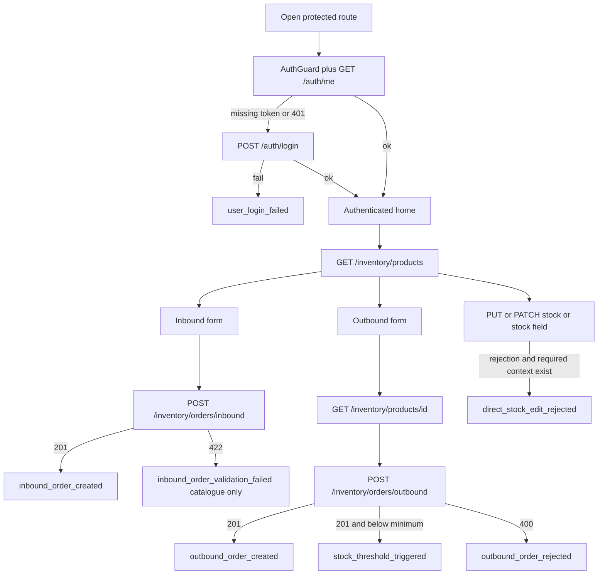

# HealthCore Telemetry Plan

Implementation-ready design for HealthCore inventory and backoffice telemetry. This document is the instrumenter's contract. Do not emit events until the corresponding schema in [event-schemas.json](./event-schemas.json) is satisfied. Do not invent missing live-system fields.

Fully designed events in this plan and in `event-schemas.json`: **16** (5 mandatory, 11 identified opportunities). Four additional catalogue opportunities appear in Phase 1 only and are not part of the 16.

---

## 1. Purpose, stakeholders, and future use

HealthCore operates 12 clinics in the United States (Texas, Florida, Georgia) and the United Kingdom (London, Manchester). The inventory system controls clinical supplies: commonly used medications, wound-care materials, PPE, and consultation-room consumables.

The live application already records authenticated inbound deliveries and outbound consumptions. It does not emit telemetry. Operations cannot currently answer inbound or outbound volume, validation failures, rejected direct-stock edits, threshold alerts, failed logins, or abandoned flows.

This plan exists so that a later instrumentation pass can produce a consistent, privacy-safe event stream without redesign.

Stakeholders and future consumers:

- **HealthCore operations and management:** purchasing consolidation, replenishment, and clinic-level supply control.
- **Marcus (Clinical Operations):** urgent stock escalation when a clinic falls below a configured minimum.
- **Claire (Compliance and Data Governance):** future compliance alerts for traceability bypass attempts and supplies approaching expiry, under HIPAA and UK GDPR.
- **Dr. Okonkwo:** future network operations dashboard and monthly executive report, aggregated by clinic and by country (`US` or `UK`).
- **Instrumenting developers:** this document and `event-schemas.json` are the source of truth for event names, envelopes, allowlists, prerequisites, and when not to emit.

Telemetry describes supplies, clinics, departments, and staff-user identifiers. It never describes individuals receiving care.

---

## 2. Evidence, live-to-contract mapping, and open gaps

### 2.1 Evidence used

| Source | Role |
| --- | --- |
| HealthCore telemetry CONTEXT (graded) | Event types, entity names, property names, enums, PHI rules, mandatory metrics |
| Company briefing in `CONTEXT.md` | Stakeholders, clinic footprint, HIPAA / UK GDPR |
| `services/api` inventory and auth | Live identifiers, routes, validation behavior |
| `uis/talent-pipeline-tracker` | Authenticated backoffice flow, navigation, session handling |

When sources conflict, the graded CONTEXT event contract wins. The live FastAPI and Next.js models are mapped into that contract. They are not renamed in application code by this assignment.

### 2.2 Live system versus graded contract

This conflict is material and is not normalized away.

Graded CONTEXT entities and rules:

- `Product`, `InboundOrder`, `OutboundOrder`
- `product_category`: `medication`, `ppe`, `consumable`, `equipment`
- `department` on consumption
- product expiry on the product
- configured minimum stock
- rejected direct stock modification

Live system:

- `MedicalSupply`, `SupplyDelivery`, `SupplyConsumption`
- categories: `ppe`, `wound_care`, `diagnostics`, `medications`, `consumables`
- no `department` field
- no `expiry_date` field
- no `minimum_stock` field
- no stock-write endpoint; extra request fields are ignored rather than rejected as a documented control

### 2.3 Instrumenter mapping table

Use this table when reading live payloads. Emit CONTEXT property names and enums, never live category strings, in designed events.

| Live value | Telemetry contract |
| --- | --- |
| `MedicalSupply.id` | `product_id` |
| `SupplyDelivery` | inbound-order concept (`inbound_order_created`) |
| `SupplyDelivery.id` | `inbound_order_id` |
| `SupplyConsumption` | outbound-order concept (`outbound_order_created`) |
| `SupplyConsumption.id` | `outbound_order_id` |
| `clinic_id` integer `1` through `12` | `clinic_id` |
| clinics `1` through `9` | `country` = `US` |
| clinics `10` through `12` | `country` = `UK` |
| `MedicalSupply.country` | **do not use** as event `country` |
| live `medications` | `medication` |
| live `consumables` | `consumable` |
| live `wound_care` | `consumable` |
| live `ppe` | `ppe` |
| live `diagnostics` | `equipment` |
| TinyDB `User.id` | envelope `userId` |
| live `consumption_type` | optional `consumption_reason` (`clinical_use` or `expiry_waste`) |
| frontend `LOW_STOCK_MAX = 10` | **not** the official threshold |

`country` is derived from the clinic registry above, not from the catalog row's regulatory jurisdiction.

### 2.4 Open gaps (instrumentation prerequisites)

Do not invent placeholder values. If a designed event requires a field or behavior that does not exist, do not emit that event.

| Prerequisite | Required for | Live state |
| --- | --- | --- |
| `department` captured on outbound consumption | `outbound_order_created` (required); `outbound_order_rejected` (optional when known) | Not collected. Live outbound form has `consumption_type` only. |
| Configured `minimum_stock` per product (and clinic, if stock is later partitioned by clinic) | `stock_threshold_triggered` | Not on `MedicalSupply`. UI `LOW_STOCK_MAX` is display-only. |
| `expiry_date` on the product | `supply_expiry_flagged` | Not on `MedicalSupply`. |
| Explicit rejection of direct stock writes, including `stock` / `current_stock` in product payloads | `direct_stock_edit_rejected` | No stock-write route. Pydantic currently ignores unknown fields. |
| All of `clinic_id`, `country`, `product_id`, `product_category`, `quantity` resolvable | every mandatory inventory event, including `direct_stock_edit_rejected` | Product context is available on catalog and order routes; a stock-write attempt without product context must not emit. |

`current_stock` is computed as `SUM(SupplyDelivery.quantity) - SUM(SupplyConsumption.quantity)` for a `MedicalSupply`. The live formula is not partitioned by `clinic_id`. Threshold evaluation in this plan is specified per clinic because CONTEXT requires clinic-level shortage detection. Until stock is computed (or stored) per clinic, do not emit `stock_threshold_triggered`.

---

## 3. Privacy and PHI rules

HIPAA (US) and UK GDPR (UK) apply. Events describe supplies and stock, never individuals receiving care.

**Prohibited in every field, including examples and test payloads:**

- Names, medical-record identifiers, diagnoses, or any value interpretable as protected health information
- `patient_id` or any care-request form field (`full_name`, `date_of_birth`, member identifiers, free-text clinical notes)
- Incident CSV row text or identifiers from `scripts/incidents-healthcore.csv`
- Staff email, name, phone number, address, password, or JWT
- Raw request or response bodies

**Allowed clinical context:** `department` or service type only (`primary_care`, `specialty_care`, `chronic_disease_management`, `preventive_health`, `general_consultation`, `chronic_care`). Department is an operational area, not a person.

**Envelope identity:**

- `userId` is the TinyDB staff-user id, or `null` when unauthenticated.
- `sessionId` may exist before login (anonymous session).
- Never put an email address, display name, or token into `userId` or `properties`.

**Sanitisation:**

- Error messages must be stripped of emails, tokens, free-text form values, and supply notes that could contain restricted data. Prefer stable reason codes.
- Stack traces are not emitted. Emit `stack_hash` only (hex SHA-256 of the raw stack).
- Route fields use path templates (`/inventory/products/{id}`), never query strings.

Each fully designed event in section 6 restates its PII and PHI treatment.

---

## 4. Authenticated inventory flow and instrumentation points

### 4.1 Flow

1. A user opens a protected backoffice route (`/`, inventory pages, or `/account/profile`).
2. `AuthGuard` checks for a JWT in `localStorage` and calls `GET /auth/me`.
3. A missing token or HTTP 401 clears the session and sends the browser to `/login`, which submits `POST /auth/login`.
4. Failed login produces `user_login_failed`.
5. Successful login stores the JWT, reaches authenticated home (`/`), and produces `user_login_succeeded`.
6. The user loads `GET /inventory/products`.
7. The user enters inbound (`/backoffice/inventory/orders/inbound`) or outbound (`/backoffice/inventory/orders/outbound`).
8. `POST /inventory/orders/inbound` returning 201 produces `inbound_order_created`.
9. An inbound request returning 422 is the catalogue opportunity `inbound_order_validation_failed` (not one of the 16 designed schemas).
10. The outbound flow reads `GET /inventory/products/{id}` so current stock is shown before quantity entry.
11. `POST /inventory/orders/outbound` returning 201 produces `outbound_order_created` only after `department` exists on the write.
12. After that successful outbound write, `stock_threshold_triggered` is produced only when per-clinic computed stock is below configured `minimum_stock`.
13. An outbound request returning 400 produces `outbound_order_rejected`.
14. A `PUT` or `PATCH` of stock, or a `stock` / `current_stock` field in a product payload, produces `direct_stock_edit_rejected` only when the live system actually rejects the attempt and all five mandatory inventory properties are resolvable.

Related navigation and session points: `page_viewed`, `inventory_flow_abandoned`, `session_expired`, `user_logout_completed`, `authorization_denied`, `api_request_completed`, `page_load_completed`, `frontend_error_uncaught`.

### 4.2 Instrumentation points (minimum set)

These points cover failed validation, direct-edit rejection, and threshold activation.

| # | Point | Location | Events |
| --- | --- | --- | --- |
| 1 | Session gate | `AuthGuard` + `GET /auth/me`; `POST /auth/login` | `user_login_succeeded`, `user_login_failed`, `session_expired` |
| 2 | Catalog load | `GET /inventory/products` after authentication | `page_viewed`, `api_request_completed` |
| 3 | Inbound completion | `POST /inventory/orders/inbound` 201 | `inbound_order_created` |
| 4 | Inbound validation failure | `POST /inventory/orders/inbound` 422 | `inbound_order_validation_failed` (catalogue only) |
| 5 | Outbound completion | `POST /inventory/orders/outbound` 201 | `outbound_order_created` |
| 6 | Insufficient stock | `POST /inventory/orders/outbound` 400 | `outbound_order_rejected` |
| 7 | Minimum threshold | After successful outbound, if remaining stock `< minimum_stock` | `stock_threshold_triggered` |
| 8 | Direct stock edit rejection | Forbidden stock write or stock field on a product payload, after explicit reject | `direct_stock_edit_rejected` |
| 9 | Abandoned order form | Inbound or outbound page hide / route change with incomplete submit | `inventory_flow_abandoned` |
| 10 | Expiry scan | Scheduled check against product `expiry_date` (prerequisite) | `supply_expiry_flagged` |



---

## 5. Phase 1 catalogue

Every retained event completes: we capture `[event_type]` because we need to know `[hypothesis]`, which allows us to make the decision `[decision]`.

Events that cannot complete that sentence are discarded in section 7.3.

### 5.1 Counts

| Class | Count | Schema status |
| --- | --- | --- |
| Mandatory (CONTEXT) | 5 | Fully designed in Markdown and JSON |
| Identified opportunity, designed | 11 | Fully designed in Markdown and JSON |
| Identified opportunity, catalogue only | 4 | Markdown hypothesis and decision only |
| **Fully designed total** | **16** | `event-schemas.json` `oneOf` branches |

Categories covered by the 16 designed events: inventory / business, authentication, performance, errors, navigation.

### 5.2 Mandatory events

**We capture `inbound_order_created` because we need to know** how much and what supply is purchased by clinic and vendor, **which allows us to make the decision** to consolidate purchasing across clinics and negotiate better vendor terms.

**We capture `outbound_order_created` because we need to know** which supplies are consumed most, and at what rate, by clinic and department, **which allows us to make the decision** to adjust automatic replenishment of critical supplies per clinic.

**We capture `stock_threshold_triggered` because we need to know** how often a clinic runs short of a critical supply, **which allows us to make the decision** to prioritise urgent restocking and escalate to Marcus in Clinical Operations.

**We capture `direct_stock_edit_rejected` because we need to know** whether staff are attempting to bypass supply-traceability controls, **which allows us to make the decision** to reinforce training or permissions at the clinics where this occurs most.

**We capture `supply_expiry_flagged` because we need to know** which supplies are approaching expiry before they become waste or a compliance risk, **which allows us to make the decision** to prioritise use or controlled disposal before expiry.

### 5.3 Identified opportunities with full schemas

**We capture `user_login_succeeded` because we need to know** which staff sessions start successfully and with which role, **which allows us to make the decision** whether access provisioning matches clinic staffing and whether to expand or restrict backoffice roles.

**We capture `user_login_failed` because we need to know** how many credential failures occur per day and whether they concentrate on specific sessions or time windows, **which allows us to make the decision** to lock down brute-force attempts, reset access process, or add staff training on credentials. No email is stored.

**We capture `session_expired` because we need to know** how often operators are interrupted by JWT expiry or missing tokens during inventory work, **which allows us to make the decision** whether 30-minute token lifetime is blocking clinic operations.

**We capture `user_logout_completed` because we need to know** whether sessions end by explicit logout or by forced 401, **which allows us to make the decision** whether shared-workstation clinics need a mandatory logout prompt.

**We capture `authorization_denied` because we need to know** where authenticated staff hit 403 (for example profile or incident-result ownership), **which allows us to make the decision** to correct role assignments rather than leaving operators blocked.

**We capture `outbound_order_rejected` because we need to know** which products accumulate the most insufficient-stock and validation failures at which clinics, **which allows us to make the decision** to fix catalog data, raise reorder points, or change the outbound form before clinics lose time on failed writes.

**We capture `api_request_completed` because we need to know** backend latency and status rates for inventory and auth routes, **which allows us to make the decision** whether James's team must scale, fix, or cache a specific route before clinic staff wait on stock writes.

**We capture `page_load_completed` because we need to know** which backoffice routes are slow to become interactive, **which allows us to make the decision** which UI bundle or data fetch to optimize first.

**We capture `frontend_error_uncaught` because we need to know** when the backoffice throws in a clinic session, **which allows us to make the decision** to halt a release or patch a specific route instead of waiting for a clinic phone call.

**We capture `page_viewed` because we need to know** which backoffice sections operators visit most, **which allows us to make the decision** which workflows to keep in the primary nav and which to simplify.

**We capture `inventory_flow_abandoned` because we need to know** whether inbound or outbound forms are left incomplete, and at which step, **which allows us to make the decision** to shorten the form, preset clinic, or require department earlier.

### 5.4 Identified opportunities, Markdown-only (not in the 16)

These remain in the catalogue so the floor is not treated as a ceiling. They do not have JSON Schema branches in `event-schemas.json` and must not be counted as designed events.

**We capture `medical_supply_created` because we need to know** how often new catalog items are added and in which CONTEXT category, **which allows us to make the decision** whether purchasing and clinic catalogs are drifting apart.

**We capture `inbound_order_validation_failed` because we need to know** which inbound fields fail FastAPI 422 checks (quantity, vendor, clinic range), **which allows us to make the decision** whether the delivery form needs inline constraints before staff retry.

**We capture `user_registered` because we need to know** how many new staff accounts are created, **which allows us to make the decision** whether registration should stay public or move to an admin invite.

**We capture `health_check_failed` because we need to know** when `GET /health` is down from clinic networks, **which allows us to make the decision** to page the Austin technology team before clinics report an outage.

---

## 6. Phase 2: event envelope and per-event allowlists

### 6.0 Shared envelope

Every fully designed event uses this envelope. Keys outside this list are forbidden at the root. Keys outside each event's property allowlist are forbidden inside `properties`.

| Field | Type | Required | Description |
| --- | --- | --- | --- |
| `eventId` | string (UUID) | required | Unique id for this emission. Generate once; do not reuse. |
| `timestamp` | string (ISO 8601 UTC) | required | Instant the event occurred, for example `2026-08-27T18:22:00Z`. |
| `sessionId` | string (UUID) | required | Browser session id. Create before login and keep until logout or expiry. |
| `userId` | string or null | required (nullable) | TinyDB staff-user id. `null` if unauthenticated. |
| `event_type` | string (`entity_action`) | required | One of the 16 designed values. |
| `schemaVersion` | string | required | Always `1.0.0`. |
| `requestId` | string (UUID) | required | Correlation id. Frontend generates it and sends `X-Request-Id` on API calls. Backend emits the same value. |
| `properties` | object | required | Event-specific payload. Allowlisted per `event_type`. |

Taxonomy: `entity_action` with consistent verbs (`created`, `triggered`, `rejected`, `flagged`, `succeeded`, `failed`, `expired`, `completed`, `denied`, `uncaught`, `viewed`, `abandoned`).

Shared inventory field types used by mandatory events:

| Field | Type | Notes |
| --- | --- | --- |
| `clinic_id` | integer `1`–`12` | Live clinic identifier. |
| `country` | `US` or `UK` | From clinic registry, not `MedicalSupply.country`. |
| `product_id` | integer (`>= 1`) | `MedicalSupply.id`. |
| `product_category` | `medication`, `ppe`, `consumable`, `equipment` | After mapping live categories. |
| `quantity` | integer | Semantics differ by event; see each allowlist. |
| `department` | enum in section 6.2 | Only where listed. Never a personal identifier. |

The five mandatory events always require `clinic_id`, `country`, `product_id`, `product_category`, and `quantity`.

---

### 6.1 `inbound_order_created` (mandatory)

- **Description:** A clinic registered receipt of supplies from a vendor (`POST /inventory/orders/inbound` HTTP 201).
- **Contains sensitive data or PII:** No. Staff identity is only envelope `userId`. Vendor name is a supplier organisation name, not a person receiving care. No PHI.
- **Anonymisation / sanitisation:** Do not copy request bodies. Do not emit staff email. Map live category before emission.
- **Prerequisite:** None beyond a successful inbound write. `department` is omitted because it does not apply to vendor receipt.
- **Delivery:** batch. Purchasing consolidation and vendor negotiation are periodic, not urgent-second decisions.

**Property allowlist** (no other keys):

| Name | Type | Required | Description |
| --- | --- | --- | --- |
| `clinic_id` | integer (`1`–`12`) | required | Receiving clinic. |
| `country` | `US` \| `UK` | required | Clinic registry country. |
| `product_id` | integer | required | `MedicalSupply.id`. |
| `product_category` | `medication` \| `ppe` \| `consumable` \| `equipment` | required | Mapped CONTEXT category. |
| `quantity` | integer (`>= 1`) | required | Units received. |
| `vendor_name` | string (`1`–`200` chars) | required | Vendor that shipped the supply. |
| `inbound_order_id` | integer (`>= 1`) | required | `SupplyDelivery.id`. |
| `total_cost` | number (`>= 0`) | required | Supply purchase cost for this inbound order, in the clinic's local currency (`USD` for US clinics, `GBP` for UK clinics). Added as an extension of this existing mandatory event so the Monthly Clinic Supply Performance Report can compute Supply Cost per Clinic. Never a patient charge. |

Example:

```json
{
  "eventId": "7c9e6679-7425-40de-944b-e07fc1f90ae7",
  "timestamp": "2026-08-27T14:05:12Z",
  "sessionId": "3d6f0a1b-9c2e-4a77-8f10-21b4c8d9e011",
  "userId": "4b8f1c2a-6d3e-4f90-a1b2-c3d4e5f60718",
  "event_type": "inbound_order_created",
  "schemaVersion": "1.0.0",
  "requestId": "a0eebc99-9c0b-4ef8-bb6d-6bb9bd380a11",
  "properties": {
    "clinic_id": 3,
    "country": "US",
    "product_id": 1,
    "product_category": "ppe",
    "quantity": 80,
    "vendor_name": "MedLine Industries",
    "inbound_order_id": 41,
    "total_cost": 18420.50
  }
}
```

---

### 6.2 `outbound_order_created` (mandatory)

- **Description:** A clinic registered consumption of a supply during a department's care activity (`POST /inventory/orders/outbound` HTTP 201).
- **Contains sensitive data or PII:** No. `department` is a service area. Optional `consumption_reason` is `clinical_use` or `expiry_waste` (live `consumption_type`), not a personal identifier. No PHI.
- **Anonymisation / sanitisation:** Never attach a care-recipient identifier. Do not emit free-text reasons.
- **Prerequisite:** `department` must be collected on the outbound write. Until that field exists, do not emit this event. Do not invent a department.
- **Delivery:** batch. Replenishment rate decisions are periodic. Urgent shortage uses `stock_threshold_triggered`.

**Property allowlist** (no other keys):

| Name | Type | Required | Description |
| --- | --- | --- | --- |
| `clinic_id` | integer (`1`–`12`) | required | Clinic where consumption occurred. |
| `country` | `US` \| `UK` | required | Clinic registry country. |
| `product_id` | integer | required | `MedicalSupply.id`. |
| `product_category` | `medication` \| `ppe` \| `consumable` \| `equipment` | required | Mapped CONTEXT category. |
| `quantity` | integer (`>= 1`) | required | Units consumed. |
| `department` | `primary_care` \| `specialty_care` \| `chronic_disease_management` \| `preventive_health` \| `general_consultation` \| `chronic_care` | required | Clinical service area only. |
| `outbound_order_id` | integer (`>= 1`) | required | `SupplyConsumption.id`. |
| `consumption_reason` | `clinical_use` \| `expiry_waste` | optional | Preserves live `consumption_type` without becoming a personal identifier. |

Example:

```json
{
  "eventId": "1b4e1900-6cd2-4f3a-9e11-0c8d2a7b5f44",
  "timestamp": "2026-08-27T15:10:03Z",
  "sessionId": "3d6f0a1b-9c2e-4a77-8f10-21b4c8d9e011",
  "userId": "4b8f1c2a-6d3e-4f90-a1b2-c3d4e5f60718",
  "event_type": "outbound_order_created",
  "schemaVersion": "1.0.0",
  "requestId": "550e8400-e29b-41d4-a716-446655440000",
  "properties": {
    "clinic_id": 1,
    "country": "US",
    "product_id": 1,
    "product_category": "ppe",
    "quantity": 12,
    "department": "primary_care",
    "outbound_order_id": 17,
    "consumption_reason": "clinical_use"
  }
}
```

---

### 6.3 `stock_threshold_triggered` (mandatory)

- **Description:** After a successful outbound order, computed stock for that product at that clinic is below the configured minimum.
- **Contains sensitive data or PII:** No. Supply and clinic identifiers only. No PHI.
- **Anonymisation / sanitisation:** Do not include catalog display names unless later authorized. This schema uses ids and category only.
- **Prerequisite:** Configured `minimum_stock` must exist, and remaining stock must be computable for that `clinic_id`. Do not use frontend `LOW_STOCK_MAX`. Do not emit if stock is only global for the product. Omit `department`.
- **Delivery:** stream. Marcus needs urgent restocking and escalation as soon as a clinic is short.

**Property allowlist** (no other keys):

| Name | Type | Required | Description |
| --- | --- | --- | --- |
| `clinic_id` | integer (`1`–`12`) | required | Clinic whose stock crossed the minimum. |
| `country` | `US` \| `UK` | required | Clinic registry country. |
| `product_id` | integer | required | `MedicalSupply.id`. |
| `product_category` | `medication` \| `ppe` \| `consumable` \| `equipment` | required | Mapped CONTEXT category. |
| `quantity` | integer (`>= 0`) | required | Remaining stock after the outbound write. |
| `minimum_stock` | integer (`>= 0`) | required | Configured minimum that was breached. |
| `triggering_outbound_order_id` | integer (`>= 1`) | required | Outbound order that caused the check. |

Example:

```json
{
  "eventId": "9a4f6c21-0b33-4d18-8e77-2c1a0b9d4e55",
  "timestamp": "2026-08-27T15:10:04Z",
  "sessionId": "3d6f0a1b-9c2e-4a77-8f10-21b4c8d9e011",
  "userId": "4b8f1c2a-6d3e-4f90-a1b2-c3d4e5f60718",
  "event_type": "stock_threshold_triggered",
  "schemaVersion": "1.0.0",
  "requestId": "550e8400-e29b-41d4-a716-446655440000",
  "properties": {
    "clinic_id": 1,
    "country": "US",
    "product_id": 1,
    "product_category": "ppe",
    "quantity": 4,
    "minimum_stock": 10,
    "triggering_outbound_order_id": 17
  }
}
```

Throttle: emit once per `product_id` + `clinic_id` until remaining stock recovers to `>= minimum_stock`.

---

### 6.4 `direct_stock_edit_rejected` (mandatory)

- **Description:** The system rejected a forbidden stock write: `PUT`/`PATCH` (or equivalent) of stock, or a `stock` / `current_stock` field on a product payload.
- **Contains sensitive data or PII:** No. Staff identity is envelope `userId` only. No PHI.
- **Anonymisation / sanitisation:** Do not emit the raw body. `quantity` is the attempted numeric stock value only.
- **Prerequisite:** The live API must actually reject the attempt (not ignore extra fields). `clinic_id`, `country`, `product_id`, `product_category`, and `quantity` must all be resolvable from the request or loaded product plus clinic context. If any of those five cannot be resolved, **do not emit**. Do not create fake identifiers. Omit `department`.
- **Delivery:** stream. Traceability bypass is a control failure Claire and clinic managers need to see quickly.

**Property allowlist** (no other keys):

| Name | Type | Required | Description |
| --- | --- | --- | --- |
| `clinic_id` | integer (`1`–`12`) | required | Clinic context of the attempt. Emit only if known. |
| `country` | `US` \| `UK` | required | Clinic registry country. |
| `product_id` | integer | required | Target `MedicalSupply.id`. |
| `product_category` | `medication` \| `ppe` \| `consumable` \| `equipment` | required | Mapped category of that product. |
| `quantity` | integer | required | Attempted stock value in the rejected write. |
| `http_method` | `POST` \| `PUT` \| `PATCH` \| `DELETE` | required | Method that was rejected. |
| `route_template` | string | required | Path template, for example `/inventory/products/{id}`. |
| `rejection_reason` | `stock_field_forbidden` \| `method_not_allowed` \| `direct_write_forbidden` | required | Why the write was rejected. |

Example:

```json
{
  "eventId": "c2d3e4f5-0617-489a-b0c1-d2e3f4051627",
  "timestamp": "2026-08-27T16:40:21Z",
  "sessionId": "3d6f0a1b-9c2e-4a77-8f10-21b4c8d9e011",
  "userId": "4b8f1c2a-6d3e-4f90-a1b2-c3d4e5f60718",
  "event_type": "direct_stock_edit_rejected",
  "schemaVersion": "1.0.0",
  "requestId": "6ba7b810-9dad-11d1-80b4-00c04fd430c8",
  "properties": {
    "clinic_id": 4,
    "country": "US",
    "product_id": 3,
    "product_category": "consumable",
    "quantity": 250,
    "http_method": "PATCH",
    "route_template": "/inventory/products/{id}",
    "rejection_reason": "stock_field_forbidden"
  }
}
```

---

### 6.5 `supply_expiry_flagged` (mandatory)

- **Description:** A supply's product-level `expiry_date` is within 30 days (or the configured window).
- **Contains sensitive data or PII:** No. `expiry_date` is a supply date, not a date of birth and not PHI.
- **Anonymisation / sanitisation:** Do not attach usage context beyond clinic and product.
- **Prerequisite:** `expiry_date` must exist on the product. Until it does, do not emit. Omit `department`.
- **Delivery:** stream. Claire's compliance risk and waste prevention need prompt action, not a weekly rollup.

**Property allowlist** (no other keys):

| Name | Type | Required | Description |
| --- | --- | --- | --- |
| `clinic_id` | integer (`1`–`12`) | required | Clinic holding the supply. |
| `country` | `US` \| `UK` | required | Clinic registry country. |
| `product_id` | integer | required | `MedicalSupply.id`. |
| `product_category` | `medication` \| `ppe` \| `consumable` \| `equipment` | required | Mapped CONTEXT category. |
| `quantity` | integer (`>= 0`) | required | Units associated with the approaching expiry. |
| `expiry_date` | string (`YYYY-MM-DD`) | required | Product expiry date (supply date). |
| `days_until_expiry` | integer (`>= 0`) | required | Whole days from `timestamp` date to `expiry_date`. |
| `expiry_window_days` | integer (`>= 1`) | required | Window used for the flag (use `30` unless configuration changes). |

Example:

```json
{
  "eventId": "0f5e4d3c-2b1a-4987-8654-3210fedcba98",
  "timestamp": "2026-08-27T07:00:00Z",
  "sessionId": "11111111-2222-4333-8444-555555555555",
  "userId": null,
  "event_type": "supply_expiry_flagged",
  "schemaVersion": "1.0.0",
  "requestId": "6ba7b811-9dad-11d1-80b4-00c04fd430c8",
  "properties": {
    "clinic_id": 11,
    "country": "UK",
    "product_id": 6,
    "product_category": "medication",
    "quantity": 9,
    "expiry_date": "2026-09-12",
    "days_until_expiry": 16,
    "expiry_window_days": 30
  }
}
```

A scheduled job may emit this with `userId` null and a dedicated `sessionId` for the job. Throttle: once per `product_id` per calendar day (UTC).

---

### 6.6 `user_login_succeeded` (identified opportunity)

- **Description:** `POST /auth/login` returned a JWT for an active staff user.
- **Contains sensitive data or PII:** Envelope `userId` is a staff identifier (workforce personal data under UK GDPR). No email, name, or password. No PHI.
- **Anonymisation / sanitisation:** Do not emit username, email, or token. Role is an application enum only.
- **Delivery:** batch. Successful login volume informs access reviews, not immediate incident response.

**Property allowlist** (no other keys):

| Name | Type | Required | Description |
| --- | --- | --- | --- |
| `auth_method` | `password` | required | How the session was established. |
| `role` | `admin` \| `manager` \| `user` | required | TinyDB role after authentication. |

---

### 6.7 `user_login_failed` (identified opportunity)

- **Description:** `POST /auth/login` failed (unknown user, bad password, inactive user, or malformed form).
- **Contains sensitive data or PII:** `userId` is `null`. No email. No PHI.
- **Anonymisation / sanitisation:** Never put the attempted username or password in properties. `failure_reason` is a closed enum.
- **Delivery:** stream. Credential-failure bursts are an operational security signal that should be visible quickly.

**Property allowlist** (no other keys):

| Name | Type | Required | Description |
| --- | --- | --- | --- |
| `failure_reason` | `invalid_credentials` \| `inactive_user` \| `malformed_request` | required | Why login failed. Map both unknown user and bad password to `invalid_credentials` so the event does not confirm account existence. |

---

### 6.8 `session_expired` (identified opportunity)

- **Description:** A protected UI or API call found a missing token, a JWT past `exp`, or `GET /auth/me` returned 401.
- **Contains sensitive data or PII:** `userId` is the staff id when it can be read from a still-decodable token; otherwise `null`. No PHI.
- **Anonymisation / sanitisation:** `attempted_route` is a path template without query string.
- **Delivery:** stream. Widespread expiry during clinic hours is an availability problem, not a weekly metric.

**Property allowlist** (no other keys):

| Name | Type | Required | Description |
| --- | --- | --- | --- |
| `expiry_source` | `jwt_exp` \| `missing_token` \| `auth_me_401` | required | Which check failed. |
| `attempted_route` | string | required | Route the operator was on or requested, for example `/backoffice/inventory/orders/outbound`. |

---

### 6.9 `user_logout_completed` (identified opportunity)

- **Description:** The staff session ended through the Log out control or a forced 401 redirect that cleared the JWT.
- **Contains sensitive data or PII:** Envelope `userId` if still known at logout; else `null`. No PHI.
- **Anonymisation / sanitisation:** Do not emit token fragments.
- **Delivery:** batch. Logout mix informs shared-workstation policy, which is not a same-second decision.

**Property allowlist** (no other keys):

| Name | Type | Required | Description |
| --- | --- | --- | --- |
| `logout_method` | `user_initiated` \| `forced_401` | required | How the session ended. |

---

### 6.10 `authorization_denied` (identified opportunity)

- **Description:** An authenticated request received HTTP 403 (for example not owner and not admin).
- **Contains sensitive data or PII:** Envelope `userId` only. No PHI.
- **Anonymisation / sanitisation:** Use `route_template`, not a body. Do not emit target user emails.
- **Delivery:** stream. Repeated 403s mean a clinic cannot complete work or a role is wrong; that needs fast correction.

**Property allowlist** (no other keys):

| Name | Type | Required | Description |
| --- | --- | --- | --- |
| `http_method` | `GET` \| `POST` \| `PUT` \| `PATCH` \| `DELETE` | required | Rejected method. |
| `route_template` | string | required | Path template. |
| `status_code` | integer | required | Always `403` for this event. |
| `denial_reason` | `not_owner` \| `insufficient_role` \| `other` | required | Closed reason code. |

---

### 6.11 `outbound_order_rejected` (identified opportunity)

- **Description:** `POST /inventory/orders/outbound` returned HTTP 400 (insufficient stock) or failed validation mapped to this event when the product and clinic context are known.
- **Contains sensitive data or PII:** No PHI. `department` optional and never a personal identifier.
- **Anonymisation / sanitisation:** Do not emit the API `detail` string if it includes the supply display name in a way that is not needed; prefer codes. This schema uses ids, counts, and `rejection_reason`.
- **Prerequisite:** Prefer emission when `clinic_id`, `country`, `product_id`, `product_category`, and requested `quantity` are known (they are on the outbound payload plus catalog lookup). If `department` is not yet collected, omit it.
- **Delivery:** stream. A clinic that cannot record consumption is an operational blockage and a leading indicator for shortage.

**Property allowlist** (no other keys):

| Name | Type | Required | Description |
| --- | --- | --- | --- |
| `clinic_id` | integer (`1`–`12`) | required | Clinic on the rejected write. |
| `country` | `US` \| `UK` | required | Clinic registry country. |
| `product_id` | integer | required | `MedicalSupply.id`. |
| `product_category` | `medication` \| `ppe` \| `consumable` \| `equipment` | required | Mapped category. |
| `quantity` | integer (`>= 1`) | required | Requested consumption quantity. |
| `available_quantity` | integer (`>= 0`) | required | Computed stock at rejection time. |
| `rejection_reason` | `insufficient_stock` \| `validation_failed` | required | Why the write did not persist. |
| `department` | same enum as section 6.2 | optional | Include only when known. |

---

### 6.12 `api_request_completed` (identified opportunity)

- **Description:** A HealthCore API HTTP request finished (auth, inventory, or other backoffice API used by the app).
- **Contains sensitive data or PII:** No. Route templates only. No PHI. No bodies.
- **Anonymisation / sanitisation:** Never put query strings, emails, or tokens in `route_template`.
- **Delivery:** batch. Latency and status-rate decisions for James's team are made from short periodic rollups, not each 2xx GET. Sampling is required (section 7.2). HTTP 5xx still uses this same event type; sampling does not drop 4xx/5xx or writes.

**Property allowlist** (no other keys):

| Name | Type | Required | Description |
| --- | --- | --- | --- |
| `http_method` | `GET` \| `POST` \| `PUT` \| `PATCH` \| `DELETE` | required | Method. |
| `route_template` | string | required | FastAPI path template. |
| `status_code` | integer (`100`–`599`) | required | HTTP status. |
| `duration_ms` | integer (`>= 0`) | required | Server-side duration in milliseconds. |
| `outcome` | `success` \| `client_error` \| `server_error` | required | `success` = 2xx, `client_error` = 4xx, `server_error` = 5xx. |

---

### 6.13 `page_load_completed` (identified opportunity)

- **Description:** A backoffice route reached a load-complete milestone (full load or client navigation).
- **Contains sensitive data or PII:** No. Route path only. No PHI.
- **Anonymisation / sanitisation:** Strip query strings (`supply_id` is an internal id; still omit query strings to keep the allowlist small and avoid accidental extra params).
- **Delivery:** batch. UI performance work is prioritized from aggregates, not per paint.

**Property allowlist** (no other keys):

| Name | Type | Required | Description |
| --- | --- | --- | --- |
| `route` | string | required | Pathname, for example `/backoffice/inventory/products`. |
| `duration_ms` | integer (`>= 0`) | required | Time to load-complete in milliseconds. |
| `navigation_type` | `full_load` \| `client_navigation` | required | How the route was entered. |

---

### 6.14 `frontend_error_uncaught` (identified opportunity)

- **Description:** An uncaught exception or unhandled promise rejection in the backoffice.
- **Contains sensitive data or PII:** Risk if unsanitised. `sanitized_message` must not contain emails, tokens, or restricted clinical text. No PHI.
- **Anonymisation / sanitisation:** Allowlist known error names. Redact message to a short safe string or `redacted`. Emit `stack_hash` (SHA-256 hex), never the stack.
- **Delivery:** stream. Uncaught UI errors are how James currently hears about failures (clinic phone). Real-time detection is the operational need.

**Property allowlist** (no other keys):

| Name | Type | Required | Description |
| --- | --- | --- | --- |
| `error_name` | string | required | `error.name` or `UnhandledRejection`. |
| `sanitized_message` | string | required | Redacted message. |
| `route` | string | required | Pathname where it occurred. |
| `stack_hash` | string (64 hex chars) | required | SHA-256 of the raw stack or rejection reason string. |

Throttle: fingerprint `error_name` + `stack_hash` + `route`; at most one matching event per minute per `sessionId`.

---

### 6.15 `page_viewed` (identified opportunity)

- **Description:** The operator viewed a backoffice route (including login and register).
- **Contains sensitive data or PII:** No. Pathname only. No PHI.
- **Anonymisation / sanitisation:** No query string. No titles that might include staff names.
- **Delivery:** batch. Navigation popularity informs IA changes on a periodic cycle.

**Property allowlist** (no other keys):

| Name | Type | Required | Description |
| --- | --- | --- | --- |
| `route` | string | required | Pathname. |
| `referrer_route` | string | optional | Previous pathname inside the app, if known. |

Throttle: debounce per `sessionId` + `route` (drop repeats within 2 seconds).

---

### 6.16 `inventory_flow_abandoned` (identified opportunity)

- **Description:** The inbound or outbound form was left without a successful submit (route change, hide, or logout) after the flow started.
- **Contains sensitive data or PII:** Optional `clinic_id` and `product_id` are operational ids. No PHI. No vendor free text on abandon (avoid partial PII-like notes; vendor is not collected here).
- **Anonymisation / sanitisation:** Do not dump form state. Only the allowlisted step and ids.
- **Delivery:** batch. Form redesign is not an urgent-second decision.

**Property allowlist** (no other keys):

| Name | Type | Required | Description |
| --- | --- | --- | --- |
| `flow_name` | `inbound_order` \| `outbound_order` | required | Which form. |
| `last_completed_step` | `form_opened` \| `product_selected` \| `quantity_entered` \| `clinic_selected` \| `ready_to_submit` | required | Furthest completed step. |
| `time_in_flow_ms` | integer (`>= 0`) | required | Time from form open to abandon. |
| `clinic_id` | integer (`1`–`12`) | optional | If already selected. |
| `product_id` | integer | optional | If already selected. |

---

## 7. Phase 3: delivery strategy

### 7.1 Stream versus batch

Justification is decision urgency or operational detection need, not transport preference.

| event_type | Mode | Why |
| --- | --- | --- |
| `inbound_order_created` | batch | Vendor-term negotiation and purchasing consolidation run on periodic reviews, not per receipt. |
| `outbound_order_created` | batch | Replenishment-rate adjustment uses volume over hours or days. Shortage urgency is `stock_threshold_triggered`. |
| `stock_threshold_triggered` | stream | Marcus must restock and escalate as soon as a clinic is below minimum. |
| `direct_stock_edit_rejected` | stream | Traceability bypass is a control incident; Claire and clinic leads need it immediately. |
| `supply_expiry_flagged` | stream | Expiry waste and compliance exposure grow with delay; flag as soon as the window is entered. |
| `user_login_succeeded` | batch | Access-pattern review is periodic. |
| `user_login_failed` | stream | Credential-attack or lockout clusters must be visible while they are happening. |
| `session_expired` | stream | Sudden expiry across clinics is an outage-like interruption of inventory work. |
| `user_logout_completed` | batch | Shared-workstation policy is not decided per click. |
| `authorization_denied` | stream | A 403 during clinic operations blocks a real task and should be corrected quickly. |
| `outbound_order_rejected` | stream | Failed consumption means the clinic cannot record use and may already be short. |
| `api_request_completed` | batch | Route SLOs are computed from intervals. Sampling plus 1-minute (or similar) batches is enough for capacity decisions. |
| `page_load_completed` | batch | Performance prioritization uses distributions, not individual paints. |
| `frontend_error_uncaught` | stream | Uncaught UI failure is the current “clinic called us” detection gap. |
| `page_viewed` | batch | Section popularity is a design input, not an on-call signal. |
| `inventory_flow_abandoned` | batch | Form drop-off informs UX changes on a planning cadence. |

### 7.2 Throttle and debounce

| Event | Control |
| --- | --- |
| `api_request_completed` | Sample successful **2xx GET** requests (emit 10%). Emit **100%** of non-GET methods and **100%** of 4xx/5xx. |
| `page_viewed` | Debounce by `sessionId` + `route`: suppress a repeat within 2 seconds. |
| `frontend_error_uncaught` | Fingerprint `error_name` + `stack_hash` + `route`. Maximum one matching event per minute per `sessionId`. |
| `stock_threshold_triggered` | Once per `product_id` + `clinic_id` until remaining stock is `>= minimum_stock`. |
| `supply_expiry_flagged` | Once per `product_id` per UTC calendar day. |
| Other designed events | No extra throttle. Volume is write- or session-bounded. |

### 7.3 Risks, exclusions, and discarded events

**Risks**

- Emitting CONTEXT categories while the live catalog still uses different strings will corrupt aggregations if mapping is skipped. Instrumenters must map before emit.
- Emitting `stock_threshold_triggered` from global `current_stock` would mis-attribute shortages to a clinic. That is why per-clinic computation is a prerequisite.
- Ignoring extra `stock` fields (current Pydantic behavior) hides bypass attempts. The event cannot fire until rejection exists.
- High-frequency `api_request_completed` without GET sampling would dominate cost and drown write events.
- `userId` is workforce personal data. Restrict warehouse access; do not join to profile name, phone, or address for dashboards used outside a need-to-know group.
- Future dashboards must aggregate; they must not drill to a care-recipient.

**Discarded events and data (with reasons)**

| Candidate | Reason discarded |
| --- | --- |
| Care-request form events (`application.html` fields) | PHI risk. Those fields are built to identify a person seeking care. |
| Incident CSV analyze or export telemetry that includes row content or `patient_id` | Source rows include `patient_id`. Even simulated identifiers are prohibited. |
| Mouse movement and scroll depth | No complete hypothesis-to-decision sentence that changes staffing, supply, or reliability choices. |
| Raw request or response bodies | Privacy and credential leakage (passwords on login, profile fields, extra JSON). |
| Staff email on failed login | Envelope anonymous `userId` null plus `failure_reason` is sufficient. Email would be unnecessary workforce PII. |
| Periodic stock gauges without a threshold | Volume without a defined decision. Shortage decisions use `stock_threshold_triggered`. |
| Frontend `LOW_STOCK_MAX = 10` as the official threshold | Display convention only. Not an authoritative configured minimum. |
| Token refresh events | Live auth has no refresh token flow. |
| Copying `MedicalSupply.name` onto every inventory event | Not required for the CONTEXT minimum; ids plus category support aggregation. Names can be joined in the warehouse from catalog tables if needed later. |

**Data excluded for privacy or cost**

- All prohibited classes in section 3.
- Unsampled 2xx GET `/inventory/products` list payloads and full order lists.
- Profile `name`, `phone`, `address` on any event.
- Passwords, JWT strings, `SECRET_KEY`, `DATABASE_URL`.

---

## 8. Instrumenter notes

### 8.1 Correlation and identifiers

1. On first page load, if `sessionId` is absent, generate a UUID and store it in `sessionStorage` (survive refresh, clear on tab end is acceptable). Keep the same `sessionId` across login.
2. For each frontend-initiated API call, generate `requestId` (UUID) and send header `X-Request-Id: <requestId>`. Backend telemetry for that call must reuse it.
3. Envelope `userId` is `User.id` from TinyDB after auth. Unauthenticated events (`user_login_failed`, some `session_expired`, scheduled `supply_expiry_flagged`) use `userId: null`.
4. `schemaVersion` is the string `1.0.0`.
5. Reject (do not emit) any payload with keys outside the envelope or the event allowlist.

### 8.2 Mapping before emit

1. Set `product_id` from `MedicalSupply.id` or `supply_id`.
2. Map live category to CONTEXT `product_category` using section 2.3. Do not emit live strings `medications`, `consumables`, `wound_care`, or `diagnostics`.
3. Set `country` from `clinic_id` via clinics 1–9 `US`, 10–12 `UK`. Do not use `MedicalSupply.country`.
4. Map `consumption_type` to optional `consumption_reason` only. It is not `department`.

### 8.3 When events must not be emitted

| Event | Do not emit when |
| --- | --- |
| `outbound_order_created` | `department` is missing. |
| `stock_threshold_triggered` | `minimum_stock` is missing, or remaining stock is not computed for that `clinic_id`, or stock is not below minimum, or the duplicate throttle has not cleared. |
| `supply_expiry_flagged` | `expiry_date` is missing, or days until expiry are greater than `expiry_window_days`, or already emitted today for that `product_id`. |
| `direct_stock_edit_rejected` | The live system did not reject the attempt, **or** any of `clinic_id`, `country`, `product_id`, `product_category`, `quantity` cannot be resolved. Never invent ids. |
| `outbound_order_rejected` | Product or clinic context cannot be resolved from the rejected request (prefer not to emit a partial mandatory-shaped inventory event). |
| Any event | Payload would include a prohibited field, extra allowlist key, or unsanitised error text. |

### 8.4 Suggested backend and frontend hook points (documentation only)

- Backend: after commit in `create_supply_delivery` / `create_supply_consumption`; in the HTTP 400 handler for `InsufficientSupplyStockError`; in `login` failure branches; in `get_current_user` 401; in 403 helpers; in middleware for `api_request_completed`; in a future explicit reject path for stock fields.
- Frontend: `LoginForm` success/fail; `AuthGuard` 401; `AppShell` logout; route change for `page_viewed` / abandon; `window.onerror` / `unhandledrejection` for `frontend_error_uncaught`; Navigation Timing or equivalent for `page_load_completed`.

Do not implement those hooks in this assignment.

### 8.5 JSON Schema

Validate emissions against [event-schemas.json](./event-schemas.json) (JSON Schema draft-07). The file defines the shared envelope, `additionalProperties: false` at envelope and properties levels, and one `oneOf` branch per designed `event_type`.
